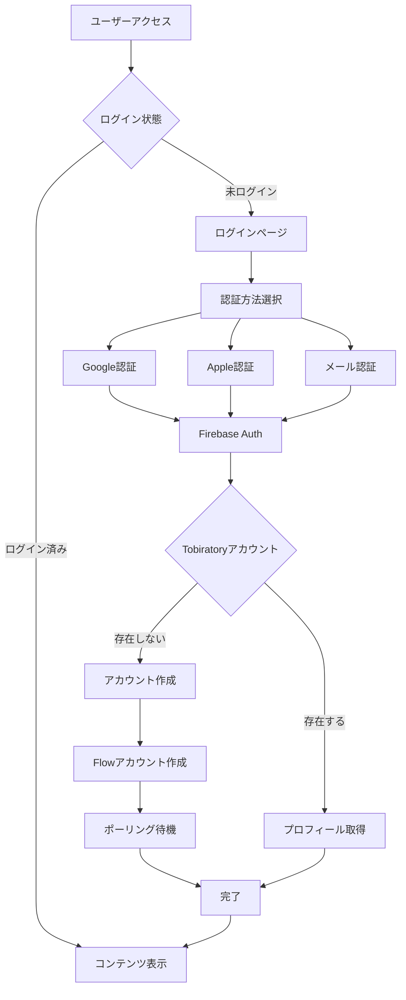

# TOBIRACAST

Tobiratory公式ポータルサイト - Notion APIとAstroで構築された次世代ブログプラットフォーム

## 📖 プロジェクト概要

TOBIRACASTは、Inutaさんの個人ブランディングとコンテンツ収益化を目的としたメディアプラットフォームです。Notionの柔軟なコンテンツ管理とAstroの高速な静的サイト生成を組み合わせ、優れたユーザー体験を提供します。

### 🎯 プロジェクトの目的

1. **個人ブランディング** - Inutaさんの作品と人柄を効果的にアピール
2. **収益化プラットフォーム** - サブスクリプション型のコンテンツ配信
3. **コミュニティ構築** - ファンとの継続的な関係構築
4. **技術的革新** - 最新のWeb技術を活用した高速で使いやすいサイト

### ✨ 主な特徴

#### コンテンツ管理
- 📝 **Notion CMS** - 直感的なNotionインターフェースで記事作成・管理
- 🏷️ **タグシステム** - 複数カテゴリによる柔軟な記事分類
- 🖼️ **画像最適化** - Sharp.jsによる自動画像処理とLazy Loading
- 🔍 **全文検索** - クライアントサイドの高速検索機能

#### 認証・会員管理
- 🔐 **マルチ認証** - Google/Apple/メールによる柔軟なログイン方式
- 👤 **Tobiratoryアカウント連携** - 既存エコシステムとの統合
- 🔗 **Flowブロックチェーン** - Web3.0対応のアカウントシステム
- 🔄 **自動リトライ機能** - エラー時の再試行メカニズム
- 🚀 **シンプルなログアウト** - ワンクリックでのセッション終了

#### デザイン・UX
- 🎨 **ブランドデザイン** - 青（#1779DE）とオレンジ（#E96800）の統一テーマ
- 📱 **完全レスポンシブ** - モバイルファーストのデザイン設計
- ⚡ **高速表示** - 静的生成による瞬時のページロード
- 🌈 **アニメーション** - スムーズなfadeInUp効果とインタラクション
- 🍔 **モバイルメニュー** - 使いやすいハンバーガーメニュー実装

## 🛠️ 技術スタック

### フロントエンド
- **[Astro](https://astro.build/)** v5.11.1 - 静的サイトジェネレーター
- **Pure CSS** - カスタムCSS変数による柔軟なテーマ管理
- **Vanilla JavaScript** - 軽量なクライアントサイド処理

### バックエンド・インフラ
- **[Notion API](https://developers.notion.com/)** - コンテンツ管理
- **[Firebase Authentication](https://firebase.google.com/docs/auth)** - 認証基盤
- **[Cloudflare Pages](https://pages.cloudflare.com/)** - ホスティング・CDN
- **[GitHub Actions](https://github.com/features/actions)** - CI/CD

### 開発ツール
- **TypeScript** - 型安全な開発
- **ESLint** - コード品質管理
- **Prettier** - コードフォーマット
- **Sharp.js** - 画像処理

## 🚀 セットアップ詳細

### 前提条件

#### 必須環境
- **Node.js** 20.18.1以上（推奨: 20.x LTS）
- **npm** 10.2.0以上 または **yarn** 1.22以上
- **Git** 2.x以上

#### 必要なアカウント
- **Notion** - コンテンツ管理用
- **Firebase** - 認証機能用（プロジェクト作成済み）
- **GitHub** - ソースコード管理
- **Cloudflare** - デプロイ用（オプション）

### 詳細なインストール手順

#### 1. リポジトリのセットアップ

```bash
# SSHでクローン（推奨）
git clone git@github.com:tobira-project/astro-notion-blog.git

# HTTPSでクローン
git clone https://github.com/tobira-project/astro-notion-blog.git

# ディレクトリ移動
cd astro-notion-blog

# リモート設定の確認
git remote -v
```

#### 2. Node.js環境の準備

```bash
# Node.jsバージョン確認
node --version  # v20.18.1以上であること

# npmバージョン確認
npm --version   # 10.2.0以上であること

# 依存関係のインストール
npm install

# インストール後の確認
npm list --depth=0
```

#### 3. Notion統合の設定

1. [Notion Integrations](https://www.notion.so/my-integrations)にアクセス
2. 「New integration」をクリック
3. 以下の設定で作成：
   - Name: `TOBIRACAST`
   - Associated workspace: 使用するワークスペース
   - Capabilities: Read content（読み取り権限）

4. 「Internal Integration Token」をコピー
5. データベースページを開き、右上の「...」→「Add connections」から統合を追加
6. データベースURLから`DATABASE_ID`を取得：
   ```
   https://notion.so/your-workspace/[ここがDATABASE_ID]?v=xxxxx
   ```

#### 4. Firebase設定

1. [Firebase Console](https://console.firebase.google.com/)にアクセス
2. `tobiratory-f6ae1`プロジェクトを選択（または新規作成）
3. 左メニュー → プロジェクトの設定 → 全般タブ
4. 「マイアプリ」セクションのWebアプリ設定をコピー
5. Authentication設定：
   - 左メニュー → Authentication → Sign-in method
   - 以下を有効化：
     - Google（OAuth同意画面の設定が必要）
     - Apple（Apple Developer Programが必要）
     - メール/パスワード（メールリンク認証を有効化）

#### 5. 環境変数の詳細設定

```bash
# .env.exampleをコピー
cp .env.example .env

# .envファイルを編集
nano .env  # またはお好みのエディタで
```

**.env設定内容**：

```env
# Notion API設定（必須）
NOTION_API_SECRET=secret_xxxxxxxxxxxxxxxxxxxxxxxxxxxxx
DATABASE_ID=22e3369e833280d9a3f6db336d2c06a2

# Firebase設定（必須）
PUBLIC_FIREBASE_API_KEY=AIzaSyXXXXXXXXXXXXXXXXXXXXX
PUBLIC_FIREBASE_AUTH_DOMAIN=tobiratory-f6ae1.firebaseapp.com
PUBLIC_FIREBASE_PROJECT_ID=tobiratory-f6ae1
PUBLIC_FIREBASE_STORAGE_BUCKET=tobiratory-f6ae1.appspot.com
PUBLIC_FIREBASE_MESSAGING_SENDER_ID=578163240854
PUBLIC_FIREBASE_APP_ID=1:578163240854:web:xxxxxxxxxxxxx
PUBLIC_FIREBASE_MEASUREMENT_ID=G-XXXXXXXXXX

# API設定（必須）
PUBLIC_API_URL=https://asia-northeast1-tobiratory-f6ae1.cloudfunctions.net

# オプション設定
CUSTOM_DOMAIN=yourdomain.com
BASE_PATH=/
PUBLIC_GA_TRACKING_ID=G-XXXXXXXXXX
ENABLE_LIGHTBOX=true
REQUEST_TIMEOUT_MS=10000
```

#### 6. 開発サーバーの起動と確認

```bash
# 開発サーバー起動
npm run dev

# ブラウザで確認
# http://localhost:4321 を開く

# ビルドテスト
npm run build

# ビルド結果のプレビュー
npm run preview
```

## 📝 Notionデータベース詳細設定

### 必須プロパティ

| プロパティ名 | タイプ | 説明 | 設定例 |
|------------|--------|------|--------|
| **Page** | title | 記事タイトル | "新機能リリースのお知らせ" |
| **Slug** | rich_text | URL用の識別子 | "new-feature-release" |
| **Date** | date | 公開日時 | 2024-01-15 |
| **Published** | checkbox | 公開状態 | ✓ |
| **Tags** | multi_select | カテゴリ分類 | Tech, News, Tutorial |
| **Excerpt** | rich_text | 記事要約（160文字推奨） | "本日、新機能をリリース..." |
| **FeaturedImage** | files | アイキャッチ画像 | image.jpg |
| **Rank** | number | 表示優先度（大きいほど上位） | 100 |

### オプションプロパティ（将来実装予定）

| プロパティ名 | タイプ | 説明 |
|------------|--------|------|
| **IsPremium** | checkbox | 有料会員限定コンテンツ |
| **PremiumContent** | rich_text | プレミアムコンテンツ本文 |
| **VideoURL** | url | 埋め込み動画URL |
| **Author** | person | 執筆者 |
| **ReadTime** | number | 読了時間（分） |

## 🔧 開発コマンド詳細

### 基本コマンド

```bash
# 開発サーバー起動（ホットリロード付き）
npm run dev
npm start  # devのエイリアス

# 本番用ビルド
npm run build

# ビルド結果のローカルプレビュー
npm run preview

# コード品質チェック
npm run lint          # ESLintチェック
npm run format        # Prettierフォーマット
npm run format:check  # フォーマットチェックのみ
```

### Notionコンテンツ管理

```bash
# Notionから最新コンテンツを取得してキャッシュ
npm run cache:fetch

# キャッシュをクリア
npm run cache:purge

# ビルド時にキャッシュを使用
npm run build:cached
```

### デバッグ・開発用

```bash
# 型定義の生成
npm run astro:types

# 依存関係の更新チェック
npm outdated

# 脆弱性チェック
npm audit

# 脆弱性の自動修正
npm audit fix
```

## 🚢 デプロイメント詳細

### GitHub Actions自動デプロイ

#### スケジュール実行
- **朝8時（JST）**: 23:00 UTC
- **夜8時（JST）**: 11:00 UTC
- Notion記事の変更を自動的に反映

#### 手動デプロイ方法

**方法1: GitHub UIから**
1. GitHubリポジトリページを開く
2. Actionsタブをクリック
3. 左サイドバーから「Deploy」を選択
4. 右上の「Run workflow」をクリック
5. ブランチを選択して実行

**方法2: GitHub CLIから**
```bash
# GitHub CLIのインストール（初回のみ）
brew install gh  # macOS
# または
winget install --id GitHub.cli  # Windows

# 認証（初回のみ）
gh auth login

# ワークフロー実行
gh workflow run deploy.yml --ref main
```

### Cloudflare Pages設定

1. Cloudflare Dashboardにログイン
2. Pages → Create a project
3. GitHubリポジトリを接続
4. ビルド設定：
   - Build command: `npm run build`
   - Build output directory: `dist`
   - Environment variables: `.env`の内容を設定

## 🔐 認証システム詳細

### 認証フロー



### エラーハンドリング

| エラーコード | 説明 | 対処法 |
|------------|------|--------|
| 401 | 認証エラー | 再ログインを促す |
| 409 | アカウント重複 | 既存アカウントとして処理 |
| 500 | サーバーエラー | リトライボタン表示 |
| timeout | タイムアウト | 自動リトライ（最大6回） |

## 🔍 実装済み機能の詳細

### 認証システム (Firebase Auth)

#### 実装内容
- **マルチプロバイダー対応**: Google、Apple、メールアドレス認証
- **Tobiratoryアカウント連携**: 既存エコシステムとの完全統合
- **Flow blockchain統合**: Web3.0対応のアカウント作成
- **エラーハンドリング**: 409エラーの自動処理、リトライ機能
- **セッション管理**: 自動ログイン維持、ログアウト機能
- **シンプルなUI実装**: ログイン/ログアウトボタンのインライン表示（ドロップダウン不使用）

#### 技術仕様
```javascript
// Firebase初期化 (src/pages/login.astro)
const firebaseConfig = {
  apiKey: import.meta.env.PUBLIC_FIREBASE_API_KEY,
  authDomain: import.meta.env.PUBLIC_FIREBASE_AUTH_DOMAIN,
  // ...
}

// Tobiratoryアカウント作成フロー
const createTobiratoryAccount = async (user) => {
  // 1. Firebase UIDでサインアップ
  const signupResponse = await fetch(`${API_URL}/signup`, {
    method: 'POST',
    body: JSON.stringify({ uid: user.uid })
  })
  
  // 2. 409エラー（既存アカウント）は正常として処理
  if (signupResponse.status === 409) {
    console.log('既存アカウント検出')
    return
  }
  
  // 3. Flowアカウント作成（ポーリング）
  await pollForFlowAccount(user.uid, 0)
}
```

### レスポンシブデザイン

#### モバイル最適化
- **ハンバーガーメニュー**: 768px以下で自動切り替え
- **モーダルスタイル**: 画面中央に表示、スムーズアニメーション
- **タッチ最適化**: 44px以上のタップ領域確保
- **フォントサイズ調整**: デバイスに応じた可読性確保

#### ブレークポイント
```css
/* デスクトップ */
@media (min-width: 769px) { ... }

/* タブレット */
@media (max-width: 768px) { ... }

/* モバイル */
@media (max-width: 480px) { ... }
```

### アニメーションシステム

#### fadeInUp効果
```css
@keyframes fadeInUp {
  from {
    opacity: 0;
    transform: translateY(20px);
  }
  to {
    opacity: 1;
    transform: translateY(0);
  }
}

/* 使用例 */
.hero-title {
  animation: fadeInUp 0.8s ease-out;
}
```

#### スタガードアニメーション
- タイトル: 0秒遅延
- 説明文: 0.1秒遅延
- ナビゲーション: 0.2秒遅延
- 記事カード: 各0.1秒ずつ遅延

### カラーシステム

#### CSS変数による一元管理
```css
:root {
  /* ブランドカラー */
  --tobiracast-primary-blue: #1779DE;
  --tobiracast-primary-orange: #E96800;
  
  /* 派生カラー */
  --tobiracast-light-blue: #4a9eff;
  --tobiracast-dark-orange: #cc5a00;
  
  /* シャドウ */
  --tobiracast-card-shadow: 0 4px 12px rgba(0, 0, 0, 0.1);
  --tobiracast-button-shadow-orange: 0 4px 20px rgba(233, 104, 0, 0.3);
}
```

### 検索機能

#### 実装詳細
- **クライアントサイド全文検索**: ページ遷移なしの高速検索
- **リアルタイム結果表示**: 入力と同時に結果更新
- **キーボードナビゲーション**: 矢印キーでの選択、Enterで遷移
- **モーダルUI**: オーバーレイ表示で没入感向上

### 画像最適化

#### Sharp.js統合
- **自動リサイズ**: 複数サイズの生成
- **フォーマット変換**: WebP対応
- **Lazy Loading**: Intersection Observerによる遅延読み込み
- **プレースホルダー**: 読み込み中の背景色表示

## 📁 詳細なプロジェクト構成

```
astro-notion-blog/
├── .github/
│   └── workflows/
│       ├── deploy.yml        # デプロイ自動化
│       ├── format.yml        # コードフォーマット
│       └── lint.yml          # Lintチェック
├── .astro/                   # Astro生成ファイル（gitignore）
├── dist/                     # ビルド出力（gitignore）
├── node_modules/             # 依存パッケージ（gitignore）
├── public/
│   ├── images/              # 静的画像
│   ├── scripts/             # クライアントJS
│   └── favicon.ico          # ファビコン
├── src/
│   ├── components/          # Astroコンポーネント
│   │   ├── AuthStatus.astro       # 認証状態表示
│   │   ├── PostCard.astro         # 記事カード
│   │   ├── SearchModal.astro      # 検索モーダル
│   │   └── notion-blocks/         # Notionブロック変換
│   ├── layouts/
│   │   └── Layout.astro           # 基本レイアウト
│   ├── lib/
│   │   ├── blog-helpers.ts        # ブログ用ヘルパー
│   │   ├── notion/
│   │   │   ├── client.ts          # Notion API クライアント
│   │   │   └── interfaces.ts      # 型定義
│   │   └── utils.ts               # ユーティリティ
│   ├── pages/
│   │   ├── index.astro            # ホームページ
│   │   ├── login.astro            # ログインページ
│   │   ├── posts/
│   │   │   ├── index.astro        # 記事一覧
│   │   │   ├── [slug].astro       # 記事詳細
│   │   │   └── page/[page].astro  # ページネーション
│   │   └── subscription.astro     # サブスクリプション
│   └── styles/
│       ├── global.css             # グローバルスタイル
│       ├── tobiracast.css         # ブランドスタイル
│       └── syntax-coloring.css    # コードハイライト
├── tmp/                     # 一時ファイル（gitignore）
├── .env                     # 環境変数（gitignore）
├── .env.example            # 環境変数サンプル
├── .gitignore              # Git除外設定
├── astro.config.mjs        # Astro設定
├── CLAUDE.md               # AI開発ガイドライン
├── LICENSE                 # MITライセンス
├── package.json            # プロジェクト設定
├── README.md               # このファイル
└── tsconfig.json           # TypeScript設定
```

## 🐛 トラブルシューティング

### よくある問題と解決方法

#### 1. Notion APIエラー
**問題**: `NOTION_API_ERROR: Could not find database`
```bash
# 解決方法
1. DATABASE_IDが正しいか確認
2. Notion統合がデータベースに接続されているか確認
3. APIトークンが有効か確認

# デバッグ手順
npm run cache:purge  # キャッシュをクリア
npm run cache:fetch  # データ再取得
```

**問題**: `NOTION_API_ERROR: Rate limited`
```bash
# 解決方法
1. REQUEST_TIMEOUT_MSを増やす（デフォルト: 10000）
2. ビルドを少し待ってから再実行
3. キャッシュビルドを使用: npm run build:cached
```

#### 2. Firebase認証エラー
**問題**: `auth/configuration-not-found`
```bash
# 解決方法
1. Firebase設定が.envに正しく記載されているか確認
2. Firebase ConsoleでWebアプリが設定されているか確認
3. 認証プロバイダーが有効化されているか確認

# 設定確認コマンド
grep PUBLIC_FIREBASE .env  # 環境変数確認
```

**問題**: `auth/popup-blocked`
```bash
# 解決方法
1. ブラウザのポップアップブロックを解除
2. ドメインをFirebase Consoleの承認済みドメインに追加
3. httpsでアクセスしているか確認
```

**問題**: 409 Conflictエラー（Tobiratoryアカウント作成時）
```bash
# これは正常な動作です
# すでにアカウントが存在する場合は409が返りますが、
# システムは既存アカウントとして処理を続行します
```

#### 3. ビルドエラー
**問題**: `Error: Cannot find module`
```bash
# 解決方法
rm -rf node_modules package-lock.json
npm install         # 完全再インストール
npm run build       # 再ビルド
```

**問題**: ESLintエラー
```bash
# 解決方法
npm run lint        # エラー確認
npm run format      # 自動修正

# 個別ファイル修正
npx eslint src/pages/index.astro --fix
```

#### 4. 画像が表示されない
**問題**: 画像が404エラー
```bash
# 解決方法
1. public/imagesディレクトリに画像があるか確認
ls public/images/

2. Notion画像URLが有効か確認
curl -I [画像URL]  # HTTPステータス確認

3. Sharp.jsが正しくインストールされているか確認
npm rebuild sharp

4. 画像処理エラーの確認
npm run build --verbose
```

#### 5. デプロイ失敗
**問題**: GitHub Actionsがエラー
```bash
# 解決方法
1. Secretsが正しく設定されているか確認
   Settings → Secrets and variables → Actions

2. Node.jsバージョンが一致しているか確認
   .github/workflows/deploy.yml内のnode-versionを確認

3. ビルドログを確認
gh run view [run-id] --log
# または
gh run list --workflow=deploy.yml
```

**問題**: Cloudflare Pagesデプロイエラー
```bash
# 解決方法
1. ビルド設定確認:
   - Build command: npm run build
   - Output directory: dist
   - Node version: 20

2. 環境変数確認:
   Settings → Environment variables
   すべての.env変数が設定されているか確認
```

#### 6. 開発環境の問題
**問題**: `npm run dev`が起動しない
```bash
# 解決方法
1. ポート競合確認
lsof -i :4321  # macOS/Linux
netstat -ano | findstr :4321  # Windows

2. 別ポートで起動
npm run dev -- --port 3000

3. キャッシュクリア
rm -rf .astro
npm run dev
```

#### 7. 認証システムの問題
**問題**: ログイン後もログイン状態が保持されない
```bash
# 解決方法
1. Cookieが有効か確認（ブラウザ設定）
2. Firebase Authの永続性設定確認
3. ローカルストレージをクリア:
   DevTools → Application → Clear Storage
```

**問題**: Flowアカウント作成がタイムアウト
```bash
# 解決方法
1. リトライボタンをクリック（最大6回まで自動リトライ）
2. ネットワーク接続を確認
3. Tobiratory APIのステータス確認
curl https://asia-northeast1-tobiratory-f6ae1.cloudfunctions.net/health
```

#### 8. モバイル表示の問題
**問題**: ハンバーガーメニューが表示されない
```bash
# 解決方法
1. ブラウザのキャッシュをクリア
2. デバイスの向きを変えてリロード
3. CSSが正しく読み込まれているか確認:
   DevTools → Network → CSSファイル確認
```

**問題**: モバイルでの文字サイズが小さい
```bash
# 解決方法
viewportメタタグが正しいか確認:
<meta name="viewport" content="width=device-width, initial-scale=1.0">
```

#### 9. パフォーマンスの問題
**問題**: ページ読み込みが遅い
```bash
# 解決方法
1. Lighthouseで分析
   DevTools → Lighthouse → Generate report

2. 画像最適化
   - WebP形式を使用
   - 適切なサイズにリサイズ
   - lazy loading実装確認

3. ビルド最適化
npm run build:cached  # キャッシュビルド使用
```

#### 10. 検索機能の問題
**問題**: SearchModal.astroでTypeError
```bash
# 解決方法
# 既に修正済み: null チェックを追加
const a = document.querySelector('.search-result ul > li.selected a')
if (a) {
  a.click()
}
```

## 💡 開発の流れと注意点

### 新機能追加の手順

1. **要件定義**
   - Notionで仕様をまとめる
   - チームで議論（Slack）
   - GitHubでIssue作成

2. **実装**
```bash
# featureブランチ作成
git checkout -b feature/機能名

# 開発サーバー起動
npm run dev

# 実装・テスト
# ...

# Lint確認
npm run lint
npm run format
```

3. **レビュー**
   - プルリクエスト作成
   - チームレビュー
   - 修正対応

4. **デプロイ**
   - mainブランチにマージ
   - 自動デプロイ実行
   - 動作確認

### コード品質維持のポイント

#### 1. 型安全性の確保
```typescript
// 良い例
interface Post {
  id: string
  title: string
  date: Date
  published: boolean
}

const getPost = (id: string): Post => {
  // ...
}

// 悪い例
const getPost = (id: any) => {
  // ...
}
```

#### 2. コンポーネントの単一責任
```astro
<!-- 良い例: 単一の責任 -->
<PostCard post={post} />
<PostDate date={post.date} />
<PostTags tags={post.tags} />

<!-- 悪い例: 複数の責任 -->
<PostEverything post={post} showDate showTags showExcerpt />
```

#### 3. CSS変数の活用
```css
/* 良い例 */
background: var(--tobiracast-primary-blue);

/* 悪い例 */
background: #1779DE;  /* ハードコーディング */
```

#### 4. エラーハンドリング
```javascript
// 良い例
try {
  const response = await fetch(url)
  if (!response.ok) {
    throw new Error(`HTTP error! status: ${response.status}`)
  }
  const data = await response.json()
  return data
} catch (error) {
  console.error('Fetch error:', error)
  // ユーザーへのフィードバック
  showErrorMessage('データの取得に失敗しました')
}

// 悪い例
const data = await fetch(url).then(r => r.json())
```

### パフォーマンス最適化のコツ

1. **画像最適化**
   - 適切なサイズ使用（srcset）
   - WebP形式の採用
   - Lazy Loading実装

2. **バンドルサイズ削減**
   - 不要な依存関係削除
   - Tree Shaking活用
   - Dynamic Import使用

3. **キャッシュ戦略**
   - Notionコンテンツのキャッシュ
   - 静的アセットの長期キャッシュ
   - Service Worker検討

### セキュリティ注意事項

1. **環境変数管理**
   - `.env`をgitignoreに含める
   - 本番環境では環境変数使用
   - APIキーの定期更新

2. **認証・認可**
   - Firebase Authのセキュリティルール設定
   - CORS設定の適切な管理
   - XSS/CSRF対策

3. **依存関係管理**
```bash
# 定期的な脆弱性チェック
npm audit
npm audit fix

# 依存関係の更新
npm outdated
npm update
```

## 🔄 開発ワークフロー

### ブランチ戦略

```bash
main           # 本番環境（保護ブランチ）
├── develop    # 開発環境
├── feature/*  # 新機能開発
├── fix/*      # バグ修正
└── hotfix/*   # 緊急修正
```

### コミットメッセージ規約

```bash
feat: 新機能追加
fix: バグ修正
docs: ドキュメント更新
style: コードスタイル変更
refactor: リファクタリング
test: テスト追加・修正
chore: ビルド・補助ツール変更
```

例：
```bash
git commit -m "feat: ログイン機能にリトライボタンを追加"
git commit -m "fix: モバイルメニューのz-index問題を修正"
git commit -m "docs: README.mdを詳細化"
```

### プルリクエストフロー

1. featureブランチ作成
```bash
git checkout -b feature/new-feature
```

2. 変更をコミット
```bash
git add .
git commit -m "feat: 新機能実装"
```

3. プッシュ
```bash
git push origin feature/new-feature
```

4. GitHub UIでPR作成
5. レビュー・マージ

## 🎯 今後の実装予定

### Phase 1: 基本機能強化（現在）
- [x] 認証システム実装
- [x] レスポンシブデザイン
- [x] 検索機能
- [ ] ダークモード対応

### Phase 2: 収益化機能
- [ ] Stripe決済統合
- [ ] サブスクリプション管理
- [ ] プレミアムコンテンツ配信
- [ ] 会員ダッシュボード

### Phase 3: コミュニティ機能
- [ ] コメント機能
- [ ] いいね機能
- [ ] 通知システム
- [ ] メンバー限定フォーラム

### Phase 4: 分析・最適化
- [ ] Google Analytics 4統合
- [ ] A/Bテスト機能
- [ ] パフォーマンス最適化
- [ ] SEO強化

## 🤝 コントリビューション

### 開発に参加する方法

1. Issueを確認または作成
2. Forkしてfeatureブランチ作成
3. 変更をコミット
4. プルリクエスト作成
5. レビュー・マージ

### コーディング規約

- ESLint/Prettierの設定に従う
- TypeScriptの型定義を活用
- コンポーネントは単一責任の原則
- CSSはBEM命名規則
- 日本語コメントOK

## 📞 サポート・お問い合わせ

### 技術的な質問
- GitHubのIssuesで質問
- Discussionsで議論

### ビジネス関連
- Email: support@tobiratory.com
- Twitter: @tobiratory

### バグ報告
GitHubのIssuesで以下の情報を含めて報告：
- 環境（OS、ブラウザ、Node.jsバージョン）
- 再現手順
- エラーメッセージ
- スクリーンショット

## 📄 ライセンス

このプロジェクトは[MIT License](LICENSE)の下で公開されています。

### 使用可能な用途
- 商用利用
- 改変
- 配布
- 私的利用

### 条件
- ライセンス表示
- 著作権表示

## 🙏 謝辞

### 技術提供
- [astro-notion-blog](https://github.com/otoyo/astro-notion-blog) - ベースプロジェクト
- [Astro](https://astro.build/) - フレームワーク
- [Notion](https://notion.so/) - CMS基盤

### 開発チーム
- **Ray** (@ray) - 主要開発者、フロントエンド実装
- **Inuta** (@inuta) - プロダクトオーナー、コンテンツディレクション
- **tererun** (@tererun) - Blockchain/バックエンド技術アドバイザー
- **jonosuke** (@jonosuke) - インフラ・認証システムアドバイザー

### Special Thanks
Tobiratoryコミュニティの皆様のフィードバックとサポートに感謝します。

---

**最終更新**: 2025年8月22日

**バージョン**: 1.1.0

### 更新履歴

#### v1.1.0 (2025-08-22)
- 認証システム完全実装
- ログイン/ログアウトUIのシンプル化
- モバイルUX大幅改善
- ドキュメント詳細化

#### v1.0.0 (2025-07-18)
- 初回リリース
- 基本機能実装

**公式サイト**: https://astro-notion-blog-7kz.pages.dev/

**GitHub**: https://github.com/tobira-project/astro-notion-blog